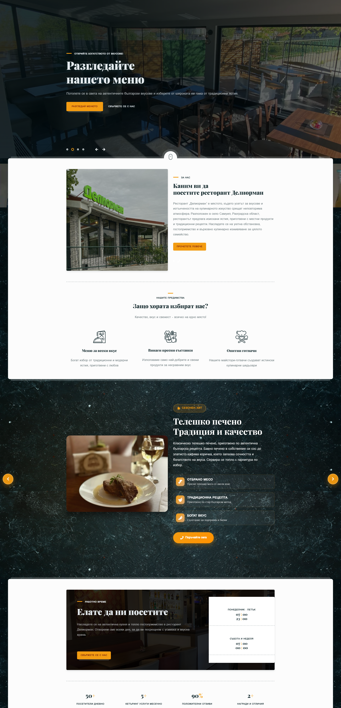
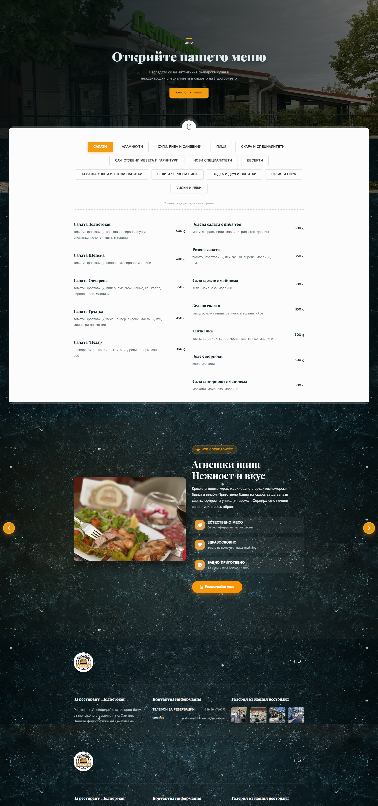

# 🍽️ Restaurant Deliorman

> A modern, fully responsive restaurant website for Deliorman Restaurant located in Samuil, Razgrad, Bulgaria. Features online table reservations, interactive menu showcase, and elegant UI/UX design.

## ✨ Features

- **📅 Online Reservations** - Interactive table booking system with date/time selection
- **🍴 Digital Menu** - Comprehensive menu display with specialty dishes and pricing
- **📱 Fully Responsive** - Optimized for mobile, tablet, and desktop devices
- **🎨 Modern UI/UX** - Clean design with smooth animations and transitions
- **🖼️ Photo Gallery** - Showcase restaurant ambiance and signature dishes
- **📍 Location Integration** - Contact information and directions
- **🕒 Business Hours Display** - Real-time operating hours visibility
- **🌐 Multilingual Support** - Content in Bulgarian for local audience

## 🛠️ Tech Stack

- **Frontend Framework:** React / Next.js
- **Styling:** CSS3 / Tailwind CSS / Styled Components
- **Form Handling:** React Hook Form / Formik
- **Deployment:** Vercel / Netlify
- **Analytics:** Google Analytics (optional)

## 🚀 Key Sections

### Hero Section
- Dynamic slider with call-to-action buttons
- Direct links to menu and reservation system
- Eye-catching visuals of signature dishes

### Menu Showcase
- Шиш Делиорман (Signature kebab specialty)
- Агнешки шиш (Lamb kebab)
- Телешко печено (Traditional veal roast)
- Full menu categorization

### About Section
- Restaurant story and philosophy
- Quality commitment highlights
- Team expertise showcase

### Reservation System
- Real-time availability checking
- Guest count selection (1-6+ people)
- Date and time picker integration
- Additional notes field

## 📊 Website Stats

- **Daily Visitors:** 500+ active users
- **Monthly Catering Services:** 30+ events
- **Customer Satisfaction:** 95% positive reviews
- **Awards & Recognition:** Multiple local accolades

## 📸 Screenshots

## 🎯 Project Goals

This project demonstrates:
- Modern web development best practices
- Responsive design implementation
- User-centric interface design
- Performance optimization
- SEO-friendly structure
- Accessibility standards compliance

## 📞 Contact & Links

- **Live Website:** [restorantdeliorman.com](https://restorantdeliorman.com)
- **Facebook:** [Restaurant Deliorman](https://www.facebook.com/profile.php?id=100063542858187)
- **Phone:** +359 89 4766273
- **Email:** restaurantdeliorman@gmail.com
- **Location:** с. Самуил, ул. "Хаджи Димитър" №6, обл. Разград

## 👨‍💻 Developer

**Melih Zafer Hyusein**
- Portfolio: [melihzafer.netlify.app](https://portfolio.melihzafer.me)
- GitHub: [@melihzafer](https://github.com/melihzafer)
- Company: OMNI Tech Solutions

## 📝 License

© Restaurant Deliorman. All rights reserved.

---

**Built with ❤️ for local businesses in Bulgaria**
