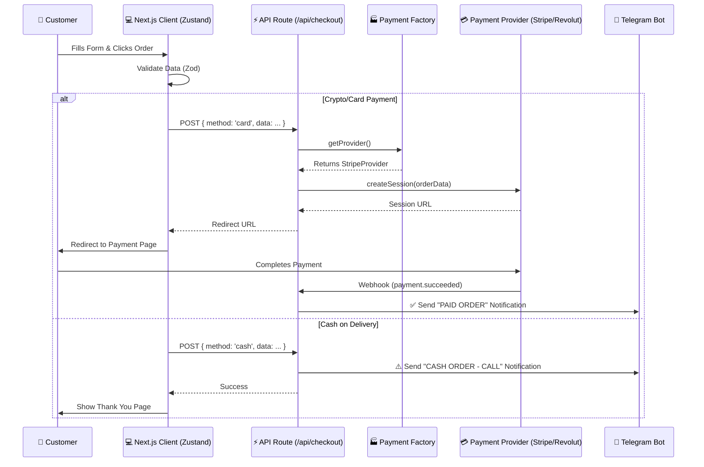

# Serverless Order System Architecture for Deliorman

> **Status:** Draft
> **Type:** Architecture Plan
> **Approach:** Database-less, Provider-Agnostic, Serverless
> **Author:** Antigravity (Senior Next.js & TypeScript Architect)

## 1. Executive Summary

This document outlines the architecture for a robust, serverless order system for the "Deliorman" restaurant. The system removes the need for a traditional database by leveraging **Stripe Metadata** and **Telegram Notifications** as the persistent record of orders.

The architecture is designed with the **Dependency Inversion Principle**, utilizing an **Adapter Pattern** for payments to ensure seamless migration from **Stripe** to **Revolut Business** (or other providers) in the future without refactoring core business logic.

---

## 2. System Architecture



---

## 3. Tech Stack & State Management

| Component | Technology | Role |
|-----------|------------|------|
| **Framework** | Next.js 14+ (App Router) | Core application logic |
| **State** | Zustand | Client-side cart & session persistence |
| **Validation** | Zod | Strict schema validation (Client & Server) |
| **Notifications** | Telegram Bot API | Instant order alerts (The "Database") |
| **Payments** | Stripe (Abstracted) | Payment processing & Metadata storage |

---

## 4. Domain Models & Validation

We enforce strict validation to ensure data integrity, especially for phone numbers since SMS verification is disabled.

### 4.1. Zod Schemas

```typescript
// lib/validations/checkout.ts
import { z } from "zod";

// Strict Bulgarian Phone Regex: 
// Matches +35987... or 087... (standard BG mobile prefixes)
const BG_PHONE_REGEX = /^(?:\+359|0)8[789]\d{7}$/;

export const checkoutSchema = z.object({
  customerName: z.string().min(2, "Name must be at least 2 characters"),
  phone: z.string()
    .regex(BG_PHONE_REGEX, "Please enter a valid Bulgarian mobile number (e.g., 0888123456)"),
  address: z.string().min(10, "Please provide a full delivery address"),
  notes: z.string().optional(),
  paymentMethod: z.enum(["cash", "card"]),
  items: z.array(z.object({
    id: z.string(),
    name: z.string(),
    price: z.number(),
    quantity: z.number(),
    // Add variants/toppings if needed
  })).min(1, "Cart is empty"),
});

export type CheckoutFallback = z.infer<typeof checkoutSchema>;
```

---

## 5. Payment Adapter Architecture (The Core)

We decouple the payment logic from the API routes using an interface.

### 5.1. The Interface (`lib/payment/types.ts`)

```typescript
export interface OrderData {
  orderId: string;
  amount: number; // in cents/stotinki
  currency: string;
  customer: {
    name: string;
    email?: string;
    phone: string;
    address: string;
  };
  items: any[];
  metadata?: Record<string, string>;
}

export interface PaymentProvider {
  name: string;
  createSession(order: OrderData): Promise<{ url: string; sessionId: string }>;
  handleWebhook(request: Request): Promise<{ event: string; orderId?: string; success: boolean }>;
}
```

### 5.2. Concrete Implementation (`lib/payment/stripe.ts`)

```typescript
import Stripe from 'stripe';
import { PaymentProvider, OrderData } from './types';

const stripe = new Stripe(process.env.STRIPE_SECRET_KEY!, { apiVersion: '2023-10-16' });

export class StripeProvider implements PaymentProvider {
  name = 'stripe';

  async createSession(order: OrderData) {
    const lineItems = order.items.map(item => ({
      price_data: {
        currency: order.currency,
        product_data: { name: item.name },
        unit_amount: Math.round(item.price * 100), // Ensure integer
      },
      quantity: item.quantity,
    }));

    const session = await stripe.checkout.sessions.create({
      payment_method_types: ['card'],
      line_items: lineItems,
      mode: 'payment',
      success_url: `${process.env.NEXT_PUBLIC_URL}/success?session_id={CHECKOUT_SESSION_ID}`,
      cancel_url: `${process.env.NEXT_PUBLIC_URL}/cart`,
      metadata: {
        // CRITICAL: We pass the full order context here to retrieve it in the webhook
        orderId: order.orderId,
        customerName: order.customer.name,
        customerPhone: order.customer.phone,
        customerAddress: order.customer.address,
        itemsSummary: JSON.stringify(order.items.map(i => `${i.quantity}x ${i.name}`)),
      },
      customer_email: order.customer.email,
    });

    return { url: session.url!, sessionId: session.id };
  }

  async handleWebhook(req: Request) {
    // Implementation of signature verification
    // Returns event details for the generic webhook route to consume
  }
}
```

### 5.3. The Factory (`lib/payment/index.ts`)

```typescript
import { StripeProvider } from './stripe';
// import { RevolutProvider } from './revolut'; // Future

export function getPaymentProvider() {
  // Logic to switch providers via ENV or Flags
  if (process.env.PAYMENT_PROVIDER === 'revolut') {
    // return new RevolutProvider();
  }
  return new StripeProvider();
}
```

---

## 6. Notification System (Telegram)

We will use visual differentiation to ensure staff instantly recognize the validation status of an order.

### 6.1. Visual Language
- **🟢 PAID (Green):** Money is secured. Kitchen can cook immediately.
- **⚠️ CASH (Yellow):** High risk. Staff **MUST** call the customer to confirm the order before cooking.

### 6.2. Message Templates

**Cash Order:**
```text
⚠️ <b>NEW CASH ORDER</b> ⚠️
-----------------------------
📞 <b>CALL TO CONFIRM:</b> +359 88 123 4567
-----------------------------
👤 <b>Ivan Petrov</b>
📍 <i>Studentski Grad, bl. 55, vh. A, ap. 12</i>

🛒 <b>Order:</b>
- 2x Adana Kebab
- 1x Ayran

📝 <b>Note:</b> No onions please.

💵 <b>Total:</b> 25.50 BGN
```

**Card Order (Verified):**
```text
✅ <b>PAID ORDER (STRIPE)</b> ✅
-----------------------------
🚀 <b>START COOKING</b>
-----------------------------
👤 <b>Ivan Petrov</b>
📍 <i>Studentski Grad, bl. 55, vh. A, ap. 12</i>
📞 +359 88 123 4567

🛒 <b>Order items...</b>
...
```

---

## 7. Implementation Roadmap

### Phase 1: Foundation (Day 1)
- [ ] Install dependencies: `stripe`, `zod`.
- [ ] Configure `zod` schemas for Checkout Form.
- [ ] Create `lib/telegram.ts` for sending formatted HTML messages.
- [ ] Test Telegram bot connectivity.

### Phase 2: Checkout Logic (Day 1-2)
- [ ] Implement `PaymentProvider` interface.
- [ ] Implement `StripeProvider` with Metadata injection.
- [ ] Build `/api/checkout` route:
    - Handle `zod` validation.
    - Branch logic: Cash -> Telegram / Card -> Provider.

### Phase 3: Webhooks & Persistence (Day 2)
- [ ] Create `/api/webhooks/stripe`.
- [ ] Verify Webhook signatures.
- [ ] Extract `metadata` (address, phone, items) from the session object.
- [ ] Send "✅ PAID" Telegram notification upon existing `payment_intent.succeeded`.

### Phase 4: UI Integration (Day 3)
- [ ] Connect `Cart` (Zustand) to the checkout form.
- [ ] Handle error states (payment declined, validation errors).
- [ ] Create `/success` page.

## 8. Folder Structure

```
src/
├── app/
│   ├── api/
│   │   ├── checkout/
│   │   │   └── route.ts       # Main entry point
│   │   └── webhooks/
│   │       └── stripe/
│   │           └── route.ts   # Listener for payments
│   ├── checkout/
│   │   └── page.tsx           # UI with RHF + Zod
├── lib/
│   ├── payment/
│   │   ├── types.ts           # Interfaces
│   │   ├── index.ts           # Factory
│   │   └── stripe.ts          # Stripe Implementation
│   ├── telegram.ts            # Bot Logic
│   └── validations/
│       └── checkout.ts        # Zod Schemas
└── store/
    └── cart-store.ts          # Zustand
```
